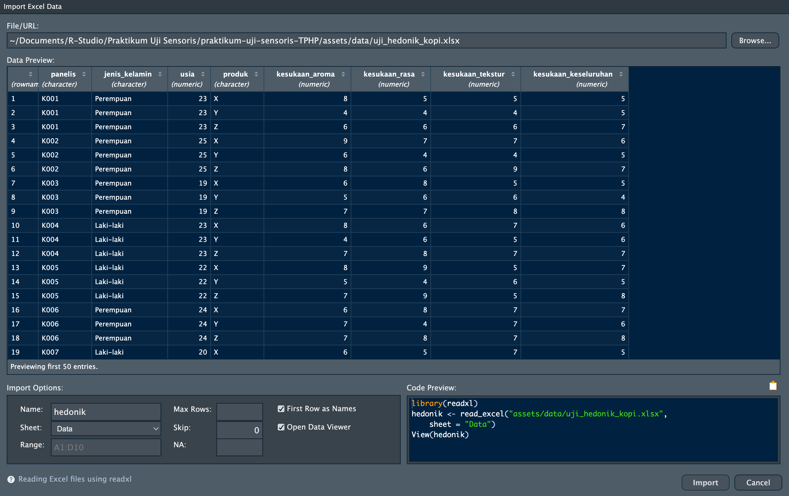

## Tujuan Pembelajaran

Setelah sesi ini, mahasiswa akan mampu:

| Mengetahui | Memahami | Melakukan |
|----|----|----|
| Cara memasang R, `RStudio`, dan paket tambahan | R menyimpan data sensori dalam objek yang dapat diperiksa, disubsetting, dan divisualisasikan | Memasang paket dengan `install.packages()` dan memuatnya dengan `library()` |
| Operator assignment `<-` | Struktur data uji sensoris: satu baris = satu panelis menilai satu produk | Memuat data hasil uji hedonik dari file Excel dengan `read_excel()` |
| Tipe data (`numeric`, `character`, `factor`, `data.frame`) | Mengapa kode panelis dan kode produk harus berupa `factor`, bukan angka | Memeriksa struktur data dengan `str()` dan `summary()` |
| Fungsi dasar: `head()`, `str()`, `summary()`, `aggregate()` |  | Membuat histogram dan boxplot skor kesukaan dengan `ggplot2` |

## Instalasi

Terdapat dua program berbeda untuk melakukan data analisis pada
`RStudio`. R adalah bahasa pemrograman, sedangkan `RStudio` adalah
*tempat kerja* untuk menulis kode R. Pemasangan harus dimulai dengan R,
kemudian dilanjutkan dengan `RStudio`. Jika `RStudio` dipasang terlebih
dahulu, bahasa R tidak akan dapat terbuka.

| Komponen | Fungsi | Tautan unduh |
|----|----|----|
| **R** (versi 4.3 atau lebih baru) | Bahasa dan mesin perhitungan | <https://cran.r-project.org/> |
| **RStudio Desktop** | *Integrated Development Environment* (IDE) tempat kita bekerja | <https://posit.co/download/rstudio-desktop/> |

> **Pastikan install sesuai dengan *operating system* masing-masing.**

## Mengenal `RStudio`

Saat `RStudio` terbuka, Anda akan melihat empat panel:

| Panel | Lokasi | Fungsi |
|----|----|----|
| **Console** | Kiri bawah | Tempat R mengeksekusi kode dan menampilkan output |
| **Source Editor** | Kiri atas | Tempat menulis dan menyimpan script (`.R`) atau dokumen (`.Rmd`) |
| **Environment** | Kanan atas | Menampilkan objek yang ada di memori R |
| **Files/Plots/Packages/Help** | Kanan bawah | Navigasi file, melihat grafik, mengelola paket, dan dokumentasi |

> **Think-aloud:** "Saya membuka `RStudio` dan melihat empat panel. Kode
> dapat ditulis langsung di Source Editor dan Console. Kode pendek untuk
> mencoba-coba saya ketik di Console; tetapi semua langkah analisis data
> sensoris saya tulis di Source Editor dan saya simpan, supaya besok
> saya masih bisa menelusuri bagaimana angka pada laporan saya
> dihasilkan."

### Memeriksa hasil instalasi

Buka `RStudio`, lalu ketik perintah berikut di **Console** (panel kiri
bawah):

```{r}
R.version.string
```

Jika muncul keterangan versi R, instalasi Anda berhasil.

## Objek dan Assignment

Dalam R, kita menyimpan data dalam *objek* menggunakan operator
assignment `<-`. Jalankan kode dengan menekan **Ctrl + Enter**.

```{r}
# Membuat objek bernama 'x' yang berisi angka 5
x <- 5

# Membuat objek bernama 'nama' yang berisi teks
nama <- "TPHP"

# Membuat objek bernama 'angka' yang berisi deret angka
angka <- c(1, 2, 3, 4, 5)

# Melihat isi objek
x
nama
angka
```

Dalam data sensoris, kita bisa juga mengisi data seperti contoh ini:

```{r}
# Objek berisi satu angka: jumlah panelis
n_panelis <- 90

# Objek berisi teks: nama produk yang diuji
produk <- "Kopi susu X"

# Objek berisi deret angka: skor kesukaan dari 6 panelis (skala 1-9)
skor <- c(7, 8, 6, 9, 5, 7)

# Melihat isi objek
n_panelis
produk
skor
```

Objek dapat langsung dihitung:

```{r}
mean(skor)   # rata-rata skor kesukaan
sd(skor)     # simpangan baku
length(skor) # banyaknya nilai
```

> **Mengapa `<-` bukan `=`?** Keduanya bisa digunakan, tetapi `<-`
> adalah konvensi R dan membuat kode lebih mudah dibaca.

> **Self-explanation prompts:**\
> 1. Apa bedanya mengetik `mean(c(7, 8, 6))` langsung, dibandingkan
> menyimpannya dulu sebagai `skor <- c(7, 8, 6)` lalu `mean(skor)`?\
> 2. Apa yang terjadi pada isi `skor` jika kita menjalankan
> `skor <- c(1, 2, 3)` setelahnya?

## Tipe Data Dasar

`R` memiliki beberapa tipe data yang penting untuk diketahui:

```{r}
# Numeric (angka)
skor <- c(7, 8, 6, 9)
class(skor)

# Character (teks)
kode_panelis <- c("K001", "K002", "K003")
class(kode_panelis)

# Factor (kategori)
kode_produk <- factor(c("X", "Y", "Z", "X", "Y"))
class(kode_produk)
levels(kode_produk)

# Logical (TRUE/FALSE) - hasil perbandingan
suka <- skor > 6
suka
```

> **Mengapa `factor` penting dalam uji sensoris?** Kode produk sering
> ditulis dengan tiga digit angka acak (misalnya 384, 726, 951). Jika
> dibiarkan sebagai `numeric`, R akan mengira 951 "lebih besar" daripada
> 384 dan mencoba menghitung rata-ratanya — padahal itu hanya label.
> Ubahlah menjadi `factor` sebelum analisis:
> `data$produk <- as.factor(data$produk)`.

### Memasang paket yang dibutuhkan

Paket (*package*) adalah kumpulan fungsi tambahan R. Beberapa paket yang
sering digunakan dalam analisis sensoris diantaranya:

| Paket        | Kegunaan dalam praktikum                             |
|--------------|------------------------------------------------------|
| `ggplot2`    | Membuat grafik (histogram, boxplot, profil sensoris) |
| `dplyr`      | Menyaring dan meringkas data                         |
| `tidyr`      | Mengubah bentuk tabel (lebar ke panjang)             |
| `readxl`     | Membaca file Excel (`.xlsx`) ke dalam R              |
| `FactoMineR` | Analisis multivariat, termasuk PCA                   |
| `factoextra` | Memvisualisasikan hasil PCA                          |
| `agricolae`  | Uji lanjut (*post-hoc*) dengan notasi huruf          |

Jalankan perintah berikut **satu kali saja** di Console (bukan di dalam
dokumen, karena tidak perlu diulang setiap *knit*):

```{r eval=FALSE}
install.packages(c("ggplot2", "dplyr", "tidyr", "readxl",
                   "FactoMineR", "factoextra", "agricolae"))
```

Setelah terpasang, paket harus **dimuat** setiap kali sesi R dimulai:

```{r message=FALSE, warning=FALSE}
library(ggplot2)
library(dplyr)
library(readxl)
```

> **Analogi:** `install.packages()` seperti membeli peralatan masak yang
> kemudian di simpan di dalam dapur. `library()` seperti mengambil
> peralatan masak yang dibutuhkan (e.g. panci, blender, pisau, dll).

> **Pesan galat yang sering muncul:**
> `Error in library(ggplot2) : there is no package called 'ggplot2'`
> berarti paket belum dipasang, bukan berarti kode Anda salah. Jalankan
> `install.packages("ggplot2")` terlebih dahulu. Jika ada pesan ini
> lagi, kuncinya adalah memasukkan library yang diminta melalui
> `install.packages("NAMA LIBRARY")`

## Memuat dan Memeriksa Data

Untuk melihat apa saja yang R bisa lakukan, kita akan menggunakan data
imajiner **uji hedonik** tiga produk kopi susu kemasan (X, Y, Z) oleh 90
panelis konsumen. Setiap panelis mencicip ketiga produk dan memberi skor
pada skala hedonik 9 titik (1 = sangat tidak suka, 9 = sangat suka).

### Membaca File

Data praktikum biasanya disimpan dalam file Excel. Pada contoh ini, file
disimpan pada `uji_hedonik_kopi.xlsx`. File tersebut memiliki dua lembar
(*sheet*): **Data** berisi angkanya, dan **Keterangan** berisi
penjelasan setiap kolom. Bacalah lembar Keterangan terlebih dahulu.

Terdapat 2 cara dalam membaca file:

1.  Cara Manual

    Dilakukan dengan klik Import Dataset (di bagian kolom Environment)
    \> From Excel \> Browse \> Ubah Name: hedonik \> Ubah Sheet: Data \>
    Copy Code yang bertulisan seperti ini:
    `hedonik <- read_excel("LOKASI FILE ANDA/uji_hedonik_kopi.xlsx", sheet = "Data")`
    ke Source Code agar file dapat dengan mudah diakses kembali.



2.  Cara Automatis

    Pastikan file `uji_hedonik_kopi.xlsx` Anda sudah berada pada folder
    yang sesuai sehingga dapat langsung dipanggil kembali.

```{r}
hedonik <- read_excel("assets/data/uji_hedonik_kopi.xlsx", sheet = "Data")

# Ubah menjadi data.frame biasa agar output R lebih mudah dibaca
hedonik <- as.data.frame(hedonik)
```

> **Mengapa perlu `sheet = "Data"`?** Tanpa argumen itu, R akan membaca
> lembar pertama. Menuliskannya secara eksplisit membuat kode Anda tetap
> benar walaupun urutan lembar berubah.

> **Tiga kesalahan yang paling sering terjadi saat input di Excel:**\
> 1. **Desimal ditulis dengan koma** (`7,5`). R akan membacanya sebagai
> teks, bukan angka. Gunakan titik (`7.5`), atau ubah pengaturan
> regional Excel Anda.\
> 2. **Judul kolom lebih dari satu baris**, atau ada baris kosong dan
> judul praktikum di atas tabel. Baris pertama harus langsung berisi
> nama kolom.\
> 3. **Nama kolom mengandung spasi** (`kesukaan rasa`). R akan
> mengubahnya menjadi `` `kesukaan rasa` `` yang merepotkan. Gunakan
> garis bawah: `kesukaan_rasa`.

### Memeriksa Struktur Data

```{r}
# Melihat 6 baris pertama
head(hedonik)

# Melihat struktur lengkap data
str(hedonik)

# Ringkasan statistik
summary(hedonik)
```

> **Think-aloud:** "Saya menjalankan `str(hedonik)` dan melihat 270
> observasi. Angka ini masuk akal: 90 panelis × 3 produk = 270 baris.
> Kalau yang muncul hanya 90 baris, berarti datanya berformat lebar dan
> perlu saya ubah dulu. Saya juga melihat `produk` masih bertipe `chr`,
> jadi saya perlu mengubahnya menjadi `factor`."

```{r}
# Mengubah kolom kategorikal menjadi factor
hedonik$produk <- as.factor(hedonik$produk)
hedonik$jenis_kelamin <- as.factor(hedonik$jenis_kelamin)

str(hedonik)
```

### *Hinge Question*

> **Sebelum melanjutkan, coba jawab pertanyaan berikut:** Data uji
> hedonik Anda memiliki 270 baris, sedangkan panelisnya hanya 90 orang.
> Apa artinya?
>
> A)  Ada 180 baris data yang terduplikasi dan harus dihapus\
> B)  Setiap panelis menilai lebih dari satu produk, sehingga satu
>     panelis mengisi beberapa baris\
> C)  Datanya salah input\
> D)  Ada 270 panelis yang sebagian tidak tercatat namanya
>
> **Jawaban: B.** Satu baris = satu kombinasi panelis × produk. Ini
> disebut format *panjang* (*long format*) dan merupakan bentuk yang
> dibutuhkan R untuk analisis.

## Subsetting Data

```{r}
# Mengambil satu kolom dengan $
hedonik$kesukaan_keseluruhan[1:10]   # 10 nilai pertama

# Mengambil baris dan kolom dengan [ ]
hedonik[1:5, ]            # 5 baris pertama, semua kolom
hedonik[1:5, c("produk", "kesukaan_rasa")]

# Menyaring baris dengan library dplyr dengan fungsi filter()
produk_X <- filter(hedonik, produk == "X")
head(produk_X)
nrow(produk_X)
```

### Meringkas Data per Produk

Inilah operasi yang paling sering Anda butuhkan pada data sensoris:
menghitung rata-rata skor untuk setiap produk.

```{r}
# Cara dasar (base R)
aggregate(kesukaan_keseluruhan ~ produk, data = hedonik, FUN = mean)
```

> Anda bisa mengubah-ubah bagian `kesukaan_keseluruhan` dengan variabel
> lainnya seperti `kesukaan_aroma` dan sebagainya. Coba yuk!

```{r}
# Cara library dplyr - lebih fleksibel karena bisa beberapa statistik sekaligus
hedonik %>%
  group_by(produk) %>%
  summarise(
    n     = n(),
    rerata = round(mean(kesukaan_keseluruhan), 2),
    sd     = round(sd(kesukaan_keseluruhan), 2)
  )
```

> **Catatan:** rata-rata saja belum cukup untuk menyimpulkan bahwa satu
> produk lebih disukai daripada yang lain. Selisih 0,3 poin bisa saja
> muncul karena kebetulan. Untuk menguji apakah selisih itu nyata, kita
> memerlukan ANOVA.

## Visualisasi Dasar dengan `ggplot2`

### Histogram: bagaimana sebaran skor kesukaan?

```{r}
ggplot(hedonik, aes(x = kesukaan_keseluruhan)) +
  geom_histogram(binwidth = 1, fill = "steelblue", color = "white") +
  labs(title = "Distribusi Skor Hedonik (Overall)",
       x = "Skor hedonik (1-9)",
       y = "Frekuensi") +
  theme_minimal()
```

### Boxplot: bagaimana perbandingan antar produk?

```{r}
ggplot(hedonik, aes(x = produk, y = kesukaan_keseluruhan, fill = produk)) +
  geom_boxplot() +
  labs(title = "Perbandingan Overall Liking Antar Produk",
       x = "Produk kopi susu",
       y = "Skor hedonik (1-9)") +
  theme_minimal() +
  theme(legend.position = "none")
```

> **Think-aloud (I Do):** "Dalam `ggplot2` saya selalu mulai dengan
> `ggplot(data, aes(...))` untuk menentukan data dan pemetaan sumbu,
> lalu menambahkan *layer* dengan tanda `+`. `geom_histogram()` untuk
> sebaran satu variabel, `geom_boxplot()` untuk membandingkan kelompok.
> Dari boxplot ini saya sudah bisa menduga produk Y paling tidak
> disukai, tetapi dugaan itu masih perlu diuji secara statistik."

## Latihan (You Do)

### Latihan 1: Eksplorasi Data

1.  Muat kembali data dan periksa strukturnya:

```{r eval=FALSE}
hedonik <- as.data.frame(read_excel("assets/data/uji_hedonik_kopi.xlsx",
                                    sheet = "Data"))
str(hedonik)
summary(hedonik)
```

2.  Berapa banyak panelis laki-laki dan perempuan dalam data ini?

```{r eval=FALSE}
table(hedonik$jenis_kelamin)
```

3.  Berapa rentang usia panelis?

```{r eval=FALSE}
range(hedonik$usia)
```

### Latihan 2: Ringkasan dan Grafik

1.  Hitung rata-rata dan standar deviasi `kesukaan_rasa` untuk setiap
    produk.

```{r eval=FALSE}
hedonik %>%
  group_by(produk) %>%
  summarise(rerata = mean(kesukaan_rasa),
            sd = sd(kesukaan_rasa))
```

2.  Buat boxplot `kesukaan_aroma` per produk. Apakah urutan produknya
    sama dengan urutan pada `kesukaan_keseluruhan`?

```{r eval=FALSE}
ggplot(hedonik, aes(x = produk, y = kesukaan_aroma, fill = produk)) +
  geom_boxplot() +
  labs(x = "Produk", y = "Kesukaan aroma (1-9)") +
  theme_minimal() +
  theme(legend.position = "none")
```

### Latihan 3: *Challenges*

1.  Buat boxplot `kesukaan_keseluruhan` per produk yang dipisahkan
    berdasarkan jenis kelamin (petunjuk: tambahkan
    `facet_wrap(~ jenis_kelamin)`).
2.  Buat *scatter plot* antara `kesukaan_rasa` (sumbu x) dan
    `kesukaan_keseluruhan` (sumbu y), diberi warna menurut produk.
    Atribut mana yang tampak paling menentukan kesukaan keseluruhan?
3.  Buat subset berisi hanya panelis berusia di bawah 21 tahun, lalu
    hitung ulang rata-rata kesukaan per produk. Apakah urutan produknya
    berubah?

## Ringkasan

Dalam sesi ini kita telah mempelajari:\
- Memasang R, `RStudio`, dan paket tambahan dengan `install.packages()`
serta memuatnya dengan `library()`\
- Objek dan assignment dengan `<-`\
- Tipe data dasar: `numeric`, `character`, `factor`, `logical`, dan
mengapa kode produk harus berupa `factor`\
- Membaca data sensoris dari file Excel dengan `read_excel()` dan
memeriksanya dengan `str()`, `summary()`, `head()`\
- Format *panjang*: satu baris = satu panelis menilai satu produk\
- Subsetting dengan `$`, `[ ]`, dan `dplyr::filter()`\
- Meringkas per produk dengan `aggregate()` dan `group_by()` +
`summarise()`\
- Visualisasi dasar dengan `ggplot2`: histogram dan boxplot

Pada sesi berikutnya kita akan menggunakan kemampuan ini untuk
menganalisis data **Quantitative Descriptive Analysis (QDA)** dengan
**ANOVA**, **uji lanjut**, dan **PCA**.
